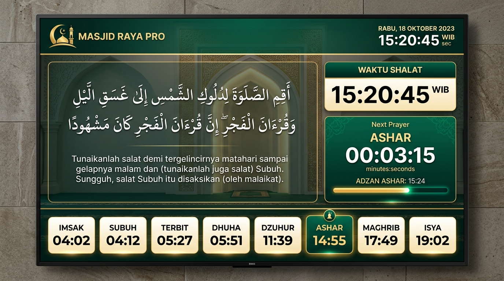

<p align="center">
  
</p>

<h1 align="center">Masjid Raya Pro</h1>

<p align="center">
  <strong>Sistem Informasi Manajemen Masjid Modern & Papan Digital Layar Sentuh / TV Masjid Pro</strong>
</p>

<p align="center">
  
  
  
  
  
  
</p>

<p align="center">
  <a href="#fitur-utama-dan-keunggulan">Fitur Utama</a> •
  <a href="#tampilan-antarmuka-display-board">Tampilan Layar</a> •
  <a href="#arsitektur-dan-teknologi">Teknologi</a> •
  <a href="#panduan-instalasi">Instalasi</a> •
  <a href="#panduan-mode-tv-display">Mode TV Display</a> •
  <a href="#struktur-proyek">Struktur Proyek</a>
</p>

---

## Tampilan Antarmuka Display Board

Papan informasi digital dirancang adaptif untuk layar TV masjid, kiosk layar sentuh, tablet, dan peramban desktop. Dilengkapi fitur **Mode TV Layar Penuh (Fullscreen)** tanpa gangguan bilah navigasi dan footer website.

<p align="center">
  
</p>

---

## Fitur Utama dan Keunggulan

### 1. Papan Informasi Digital (Display Board TV & Kiosk)
- **Desain Khusus TV & Kiosk:** Tata letak digital signage murni dengan latar belakang kaligrafi islami, lengkung mihrab, dan ornamen geometri bintang delapan (Khatam).
- **Mode TV Layar Penuh (Fullscreen):** Sekali klik untuk mengubah peramban menjadi display TV masjid tanpa menu navigasi, badge teknis, atau footer situs.
- **Kaligrafi Al-Qur'an Rasm Utsmani:** Menampilkan ayat-ayat pilihan dengan font kaligrafi Utsmani autentik (*Amiri Quran* & *Scheherazade New*, disajikan mandiri/self-host tanpa CDN) berlatar transparan yang menyatu anggun dengan arsitektur mihrab.
- **Pemutar Murottal Cerdas:** Mendukung mode ayat pilihan dan mode surah penuh. Pada pemutaran surah penuh, sistem melantunkan seluruh ayat berurutan dari ayat 1 hingga selesai sebelum otomatis berpindah ke surah berikutnya.
- **Pilihan Reciter Murottal Terverifikasi:** 12 qari terkemuka (Mishary Alafasy, Abdul Basit, Al-Husary, Minshawi, Maher Al-Muaiqly, As-Sudais, dll.) dapat diganti lewat Admin → Pengaturan → Suara murottal, lengkap dengan pratinjau audio.
- **Jam Tabular & Hitung Mundur Shalat:** Jam digital presisi tinggi, hitung mundur menuju waktu shalat berikutnya, dan progress bar kemajuan waktu antar-shalat.
- **Deteksi Wilayah Otomatis:** Menyesuaikan jadwal shalat secara dinamis berdasarkan geolokasi/jaringan pengguna di seluruh Indonesia, dengan fallback default ke Jakarta.
- **Rel Jadwal Shalat 8 Waktu:** Imsak, Subuh, Terbit, Dhuha, Dzuhur, Ashar, Maghrib, dan Isya dengan penanda waktu aktif berkontras tinggi yang responsif di segala ukuran layar.
- **Fitur Khusus Ramadhan:** Deteksi otomatis bulan suci Ramadhan yang menampilkan jadwal Imsak dan hitung mundur waktu Berbuka puasa.

### 2. Otomasi Adzan Khusus Subuh & Suara Iqomah
- **Adzan Khusus Subuh dengan Tatswib:** Pemutaran adzan subuh autentik dengan lafadz *« الصَّلَاةُ خَيْرٌ مِنَ النَّوْمِ »* (*Ash-shalatu khairum minan-naum*).
- **Pemilihan Audio Otomatis:** DisplayBoard secara cerdas membedakan audio adzan Subuh vs adzan 4 waktu shalat lainnya.
- **Berkas Audio Bundel Lokal:** File audio berkualitas tinggi tersimpan langsung di `public/audio/adzan-subuh.mp3`, memastikan adzan tetap berkumandang tepat waktu meskipun koneksi internet terputus.
- **Pengaturan Mandiri Admin:** Konfigurasi pilihan suara adzan reguler dan adzan subuh terpisah, mendukung pemilihan bawaan atau unggah audio kustom masjid.

### 3. Layanan Jamaah & Publik
- **Jadwal Shalat Lengkap:** Waktu hisab akurat berbasis standar Kementerian Agama Republik Indonesia (Subuh -20°, Isya -18°) dan data otomatis Aladhan.
- **Jadwal Khutbah Jumat:** Agenda penceramah, tema khutbah, dan arsip khutbah pekanan.
- **Kegiatan & Agenda Masjid:** Publikasi pengajian, majelis taklim, bakti sosial, dan kalender kegiatan jamaah.
- **Kabar & Berita:** Kanal informasi resmi dan pengumuman DKM kepada masyarakat.
- **Galeri Dokumentasi:** Dokumentasi foto pembangunan, renovasi, dan kebersamaan ibadah masjid.
- **Jadwal Petugas Ibadah:** Transparansi petugas imam rawatib, khatib, muadzin, dan bilal.
- **Laporan Transparansi Kas:** Rekapitulasi kas pemasukan (infaq, sedekah, zakat) dan pengeluaran operasional masjid secara terbuka dan akuntabel.

### 4. Panel Admin & Keamanan Tingkat Tinggi
- **Autentikasi NextAuth & Role-Based Access:** Mendukung peran multi-level (`admin`, `pengurus`, dan `jamaah`).
- **Keamanan Brute-Force Berlapis:** Sistem *sliding window rate-limiting* ganda menambatkan batas percobaan masuk pada alamat IP klien dan akun email.
- **Validasi Input Ketat (Zod):** Setiap payload permintaan divalidasi dengan skema ketat (*strict schema*), menolak data tak dikenal dan melindungi integritas database.
- **Penyimpanan Berkas Aman:** Berkas unggahan (foto kegiatan, audio adzan) diverifikasi lewat *magic bytes* biner asli (bukan sekadar ekstensi), disimpan di luar root publik (`uploads/`), dan dialirkan via `/api/media` dengan header proteksi `X-Content-Type-Options: nosniff`.
- **Ketahanan Font & Build:** Konfigurasi font stack mandiri yang menjamin aplikasi dapat dikompilasi dan dijalankan secara sempurna baik online maupun offline.

---

## Arsitektur dan Teknologi

| Komponen | Teknologi | Keterangan |
| :--- | :--- | :--- |
| **Framework Utama** | [Next.js 15](https://nextjs.org/) | App Router, Server Components & Route Handlers |
| **Bahasa Pemrograman** | [TypeScript 5](https://www.typescriptlang.org/) | Type-safe end-to-end |
| **Styling & Desain** | [Tailwind CSS v4](https://tailwindcss.com/) | `@theme inline`, utilitas modern & CSS Variables |
| **Tipografi** | `next/font` (self-host) | Plus Jakarta Sans (UI), Marcellus (judul), Amiri Quran/Scheherazade/Amiri/Reem Kufi (Arab) |
| **Basis Data & ORM** | [Prisma](https://www.prisma.io/) + SQLite | Relasional, ringan, tanpa konfigurasi rumit |
| **Autentikasi** | [NextAuth.js v4](https://next-auth.js.org/) | JWT session, bcrypt password hashing |
| **Validasi Skema** | [Zod](https://zod.dev/) | Validasi runtime dan tipe data |
| **Audio & Murottal** | Web Audio API + CDN EveryAyah | 12 reciter pilihan + bundel audio adzan lokal |
| **Continuous Integration** | GitHub Actions | Linting, validasi tipe (tsc), dan uji kompilasi produksi |

---

## Panduan Instalasi

### 1. Klon Repositori
```bash
git clone https://github.com/99apps-id/masjid-raya.git
cd masjid-raya
```

### 2. Pasang Dependensi
```bash
npm install
```

### 3. Konfigurasi Lingkungan (`.env`)
Salin file `.env.example` ke `.env`:
```bash
cp .env.example .env
```
Sesuaikan konfigurasi pada file `.env`:
```env
# Rahasia JWT NextAuth (wajib diisi untuk keamanan sesi)
NEXTAUTH_SECRET="buat-kunci-rahasia-acak-anda-di-sini"

# URL dasar aplikasi
NEXTAUTH_URL="http://localhost:3000"

# (Opsional) Sandi awal saat menjalankan seed
SEED_ADMIN_PASSWORD="SandiAdmin123!"
SEED_PENGURUS_PASSWORD="SandiPengurus123!"
```

### 4. Migrasi Database & Seeding
Inisialisasi skema Prisma dan isi data awal:
```bash
npx prisma generate
npx prisma db push
npm run db:seed
```

*Akun default hasil seeding:*
- **Admin**: `admin@masjidrayapro.com`
- **Pengurus**: `pengurus@masjidrayapro.com`

### 5. Jalankan Aplikasi
```bash
npm run dev
```
Buka peramban di [http://localhost:3000](http://localhost:3000).

---

## Panduan Mode TV Display

Untuk menggunakan aplikasi ini sebagai **Digital Signage TV Masjid**:
1. Buka peramban di Smart TV, Android TV Box, Mini PC, atau Raspberry Pi yang terhubung ke monitor masjid.
2. Akses halaman utama `http://alamat-ip-server:3000/`.
3. Klik tombol **"Mode TV Layar Penuh"** di pojok kanan atas (atau tekan tombol `F11` pada keyboard).
4. Seluruh bilah navigasi, tombol kontrol, dan footer akan disembunyikan otomatis, menampilkan layar informasi masjid yang bersih, megah, dan proporsional.
5. Untuk keluar dari mode layar penuh, klik tombol **"Keluar Layar Penuh"** atau tekan `Escape` / `F11`.

---

## Struktur Proyek

```text
masjid-raya-pro/
├── .github/
│   └── workflows/
│       └── ci.yml             # Pipa pengujian otomatis GitHub Actions
├── prisma/
│   ├── schema.prisma          # Skema model basis data
│   └── seed.ts                # Data inisialisasi awal
├── public/
│   ├── audio/
│   │   └── adzan-subuh.mp3    # Audio adzan subuh bawaan (tatswib)
│   ├── logo.svg               # Logo vektor resmi Masjid Raya Pro
│   └── displayboard-preview.jpg # Pratinjau layar display board
├── src/
│   ├── app/
│   │   ├── (public)/          # Halaman umum (jadwal, khutbah, kas, dll)
│   │   ├── admin/             # Panel kelola admin & pengurus
│   │   ├── api/               # Endpoint REST API terlindungi
│   │   ├── globals.css        # Palet warna, keyframes & font Utsmani
│   │   ├── icon.svg           # Favicon & ikon aplikasi vektor profesional
│   │   ├── layout.tsx         # Root layout aplikasi
│   │   └── page.tsx           # Halaman utama Display Board Kiosk
│   ├── components/
│   │   ├── AyatShowcase.tsx   # Carousel ayat Utsmani + autoplay murottal
│   │   ├── BrandMark.tsx      # Siluet arsitektur kubah & menara resmi
│   │   ├── DisplayBoard.tsx   # Papan display TV + toggle fullscreen
│   │   ├── CalligraphyBackdrop.tsx # Latar mihrab & girih islami
│   │   ├── Ikon.tsx           # Pustaka ikon garis profesional
│   │   ├── LogoMasjid.tsx     # Komponen lambang masjid adaptif
│   │   └── ...                # Formulir CRUD & navigasi admin
│   └── lib/
│       ├── azan.ts            # Katalog adzan reguler & subuh
│       ├── ayat.ts            # Koleksi ayat Al-Qur'an & integrasi audio
│       ├── hisab.ts           # Algoritma hisab jadwal shalat Kemenag RI
│       ├── kota.ts            # Katalog kota & deteksi lokasi Indonesia
│       ├── murottal.ts        # Katalog 12 reciter EveryAyah terverifikasi
│       ├── papan.ts           # Kalkulasi hitung mundur waktu shalat & iqomah
│       ├── settings.ts        # Definisi kunci konfigurasi sistem
│       └── upload.ts          # Manajemen upload aman berbasis magic bytes
└── package.json
```

---

## Pengujian & Verifikasi Kualitas

Aplikasi ini dilengkapi alur verifikasi mutu terintegrasi:
```bash
# Pemeriksaan linter kode
npm run lint

# Validasi kelengkapan tipe TypeScript
npx tsc --noEmit

# Pengujian kompilasi produksi
npm run build
```

---

## Lisensi

Dikembangkan untuk kemakmuran masjid dan kenyamanan umat. Dirilis di bawah lisensi [MIT](LICENSE).
